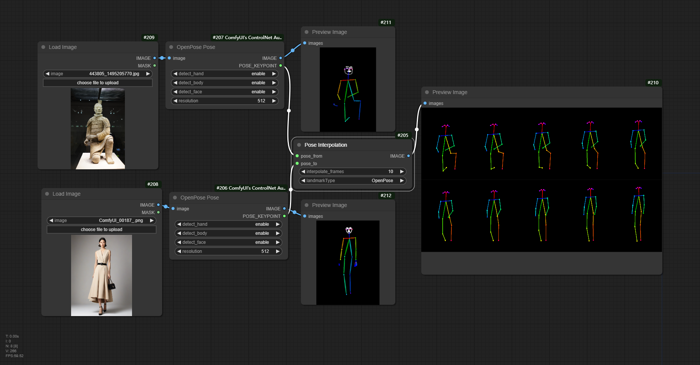

# ComfyUI_pose_inter
Generate transition frames between two character posture images. The prerequisite for running is to have installed [comfyui_controlnet_aux](https://github.com/Fannovel16/comfyui_controlnet_aux), using its Open Pose or DWPose preprocessor

在两张人物姿势图片之间生成过渡帧。运行的前提是安装了  [comfyui_controlnet_aux](https://github.com/Fannovel16/comfyui_controlnet_aux)  使用它的open pose或者dwpose预处理器

