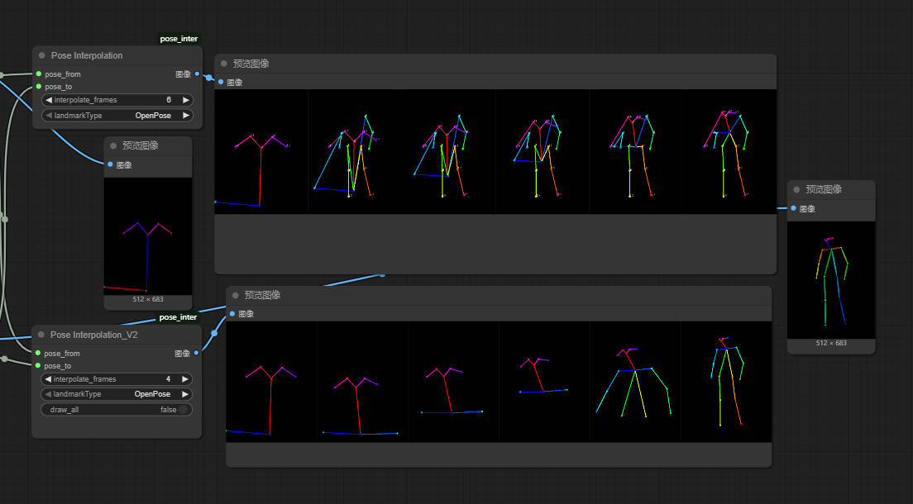
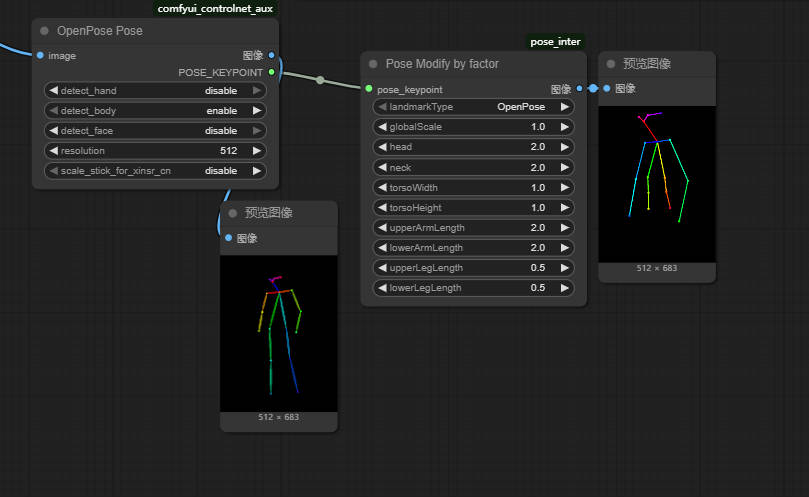

# ComfyUI_pose_inter
Generate transition frames between two character posture images. The prerequisite for running is to have installed [comfyui_controlnet_aux](https://github.com/Fannovel16/comfyui_controlnet_aux), using its Open Pose or DWPose preprocessor

在两张人物姿势图片之间生成过渡帧。运行的前提是安装了  [comfyui_controlnet_aux](https://github.com/Fannovel16/comfyui_controlnet_aux)  使用它的open pose或者dwpose预处理器

Don't use the old nodes anymore. I've created new V2 nodes. The image below shows the differences between the two. Especially when the poses in the two images are very different, the new node performs much better than the old one.

不要再用旧节点，我写了新的V2节点，下面的图片显示了两者的区别。特别是两张图片的姿势区别很大的时候，新节点比旧节点的效果好很多。

New feature: Pose Modify. It allows you to adjust the length of each body part individually. It is suitable for driving chibi (super-deformed) characters with human poses.

新功能：Pose Modify，允许单独修改身体每个部分的长度，适合用在用人类姿势驱动Q版大头娃娃的时候。

